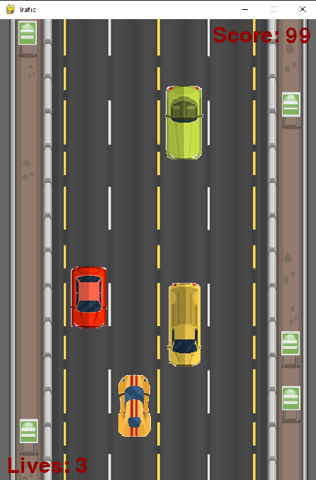
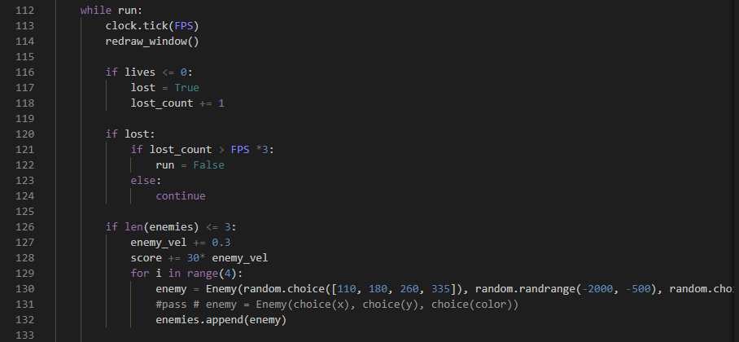

# Car_Game_Python

- Repository: `Learning Python`
- Type of challenge:  `Learning new Possibilities`
- Duration: `1 day`

## My Project
This little Sunday project is a Tetris game with the help of pygame to get better at python and to see the different possibilities that are offered with python/pygame which are amazing and incredibly interesting.  
This is one of my first projects and first ever game in python and is strongly inspired from a youtube video because those are my first steps with pygame and even python.  
inspired from: https://www.youtube.com/watch?v=uoR4ilCWwKA&t=6s&ab_channel=TechWithTim

## Instructions to test the game
- Open the 'Tetris_in_Python.exe' file
- Download it, accept the antivirus messages, trust me :) OR NOT.
- Then choose were you want to install the game.
- It will install a folder and in the folder there is a 'tetris.exe' file, open it.
- You might need to turn off the antivirus temporarily.
- You can then play tetris and you will surely beat my highscore of 175 ;)

## The Game 

## My Code

### Hope you enjoy it! 

